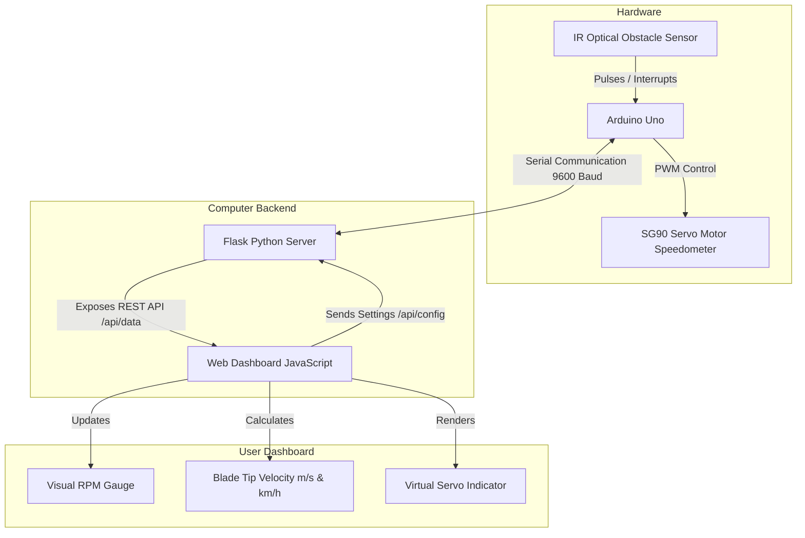

# Aerovane: Fan RPM and Speed Measurement System

Aerovane is a complete end-to-end telemetry and physical speed monitoring system. It uses an **Arduino Uno** to detect fan rotations via an **IR sensor**, uses a **SG90 Servo Motor** as a physical speedometer dial, and serves a modern, responsive, and glassmorphic **Flask Web Dashboard** for real-time visualization and configuration.

---

## System Architecture



---

## Hardware Setup & Wiring Instructions

### Components Required
1. **Arduino Uno** (or compatible board)
2. **IR Sensor Module** (Active-Low Digital Output obstacle / optical speed sensor)
3. **SG90 Micro Servo Motor**
4. **USB Type-A to Type-B Cable** (Arduino connection)
5. **Jumper Wires & Breadboard**

### Wiring Table

| Component | Pin on Component | Pin on Arduino Uno | Description |
| :--- | :--- | :--- | :--- |
| **IR Sensor** | VCC | 5V | Power supply (5V) |
| **IR Sensor** | GND | GND | Common ground |
| **IR Sensor** | OUT / DO | Digital Pin 2 | Signal output (Interrupt 0) |
| **SG90 Servo**| Red (VCC) | 5V | Power supply (5V) |
| **SG90 Servo**| Brown/Black (GND)| GND | Common ground |
| **SG90 Servo**| Orange/Yellow (SIG)| Digital Pin 9 | PWM Servo Control signal |

> [!CAUTION]
> If your SG90 Servo draws excessive current and causes the Arduino Uno to brown out/reset under high loads, power the servo using a separate, regulated external **5V power supply**, connecting the external supply's GND to the Arduino Uno's GND.

---

## Software Noise Filtering Logic

To prevent double-triggering or reading ambient optical noise, the system implements three layers of filtering:
1. **Interrupt Debounce (1.5ms)**: Any interrupt triggered within 1.5ms of a valid pulse is immediately ignored. This limits the maximum input pulse rate to roughly 40,000 pulses/minute (well above typical fans).
2. **Microsecond Pin Verification**: When the interrupt is triggered (on falling edge), the micro-controller waits 5 microseconds and re-reads Pin 2. If the pin is no longer LOW, the trigger is discarded as a transient EMF noise spike.
3. **Exponential Smoothing Filter**: Rather than updating the servo and web dashboards with raw pulse fluctuation, the Arduino uses an exponential smoothing filter:
   $$RPM_{smoothed} = 0.7 \times RPM_{previous} + 0.3 \times RPM_{raw}$$

---

## Installation & Running Guide

### 1. Arduino Firmware Flash
1. Install the [Arduino IDE](https://www.arduino.cc/en/software).
2. Open the file `arduino/fan_rpm_speedometer/fan_rpm_speedometer.ino`.
3. Connect your Arduino Uno to the computer via USB.
4. Select **Arduino Uno** and your active port in the IDE.
5. Click **Upload** to flash the code.

### 2. Python Environment Setup
We recommend running inside a Python virtual environment.

```bash
# Navigate to the project directory
cd /Users/shauarya/.gemini/antigravity/scratch/fan_rpm_measurement

# Create virtual environment
python3 -m venv venv

# Activate virtual environment
source venv/bin/activate

# Install required python packages
pip install -r requirements.txt
```

### 3. Running the Flask Backend
Run the Flask application with:

```bash
python backend/app.py
```

- Flask will attempt to open connection to the Arduino Uno on port `/dev/tty.usbmodemFX2348N1`.
- **Automatic Reconnection**: If the port is busy or the Arduino is unplugged, the backend handles this gracefully and will auto-reconnect the moment the device is plugged in.
- **Simulation Fallback**: If the hardware is not connected, the server automatically enters **Mock Simulation Mode**. You will see the speed ramp up and down in waves on the dashboard so you can test all UI elements, gauge movements, speed calculations, and forms without needing the hardware.

---

## Dashboard Calculations

The web dashboard calculates the peripheral blade tip speed dynamically using the following math:

1. **Circumference ($C$)**:
   $$C = 2 \times \pi \times \text{radius (meters)}$$
2. **Speed in meters per second ($v_{m/s}$)**:
   $$v_{m/s} = \frac{RPM \times C}{60}$$
3. **Speed in kilometers per hour ($v_{km/h}$)**:
   $$v_{km/h} = v_{m/s} \times 3.6$$
